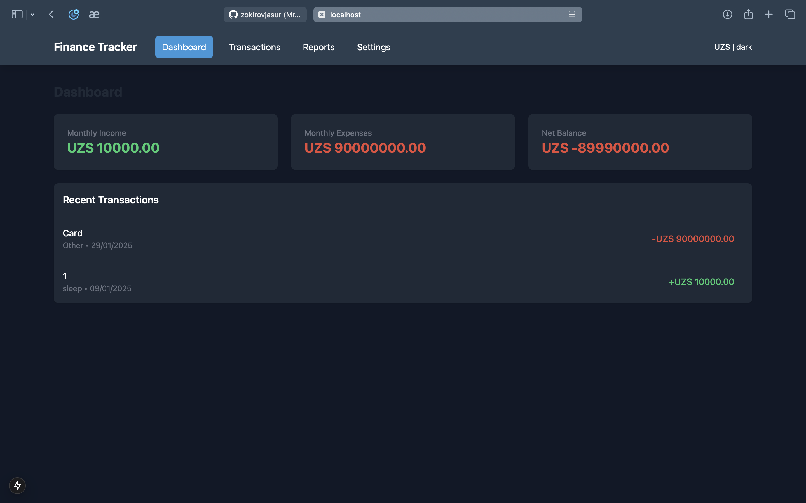
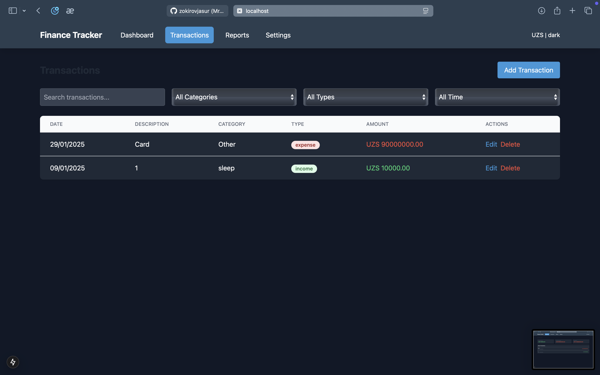
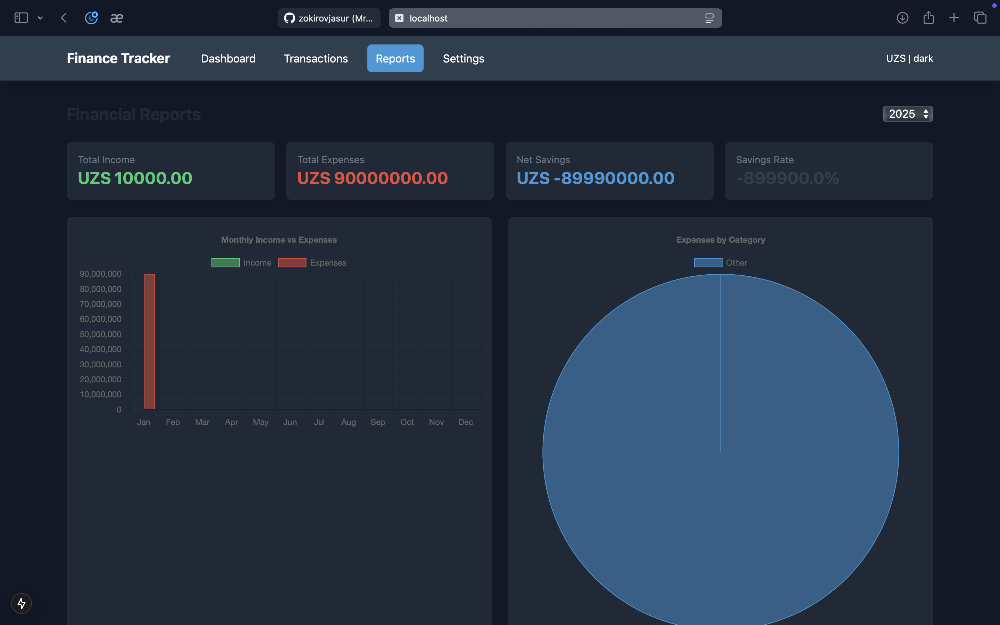

# Molya

Next.js va React yordamida qurilgan zamonaviy veb-ilova, foydalanuvchilarga shaxsiy moliya boshqarishda yordam beradi. Daromad, xarajatlarni kuzatib borish va sarf-xarajatlarni interaktiv vizualizatsiyalar yordamida nazorat qilish imkonini beradi.
Xususiyatlar

## Features

💰 Daromad va xarajatlarni batafsil tasniflash bilan kuzatish
📊 Interaktiv diagrammalar yordamida ma'lumotlarni vizual tarzda ko'rsatish
🌓 Yorug'lik/Qorong'u rejimlarini qo'llab-quvvatlash

  

  

  

 

